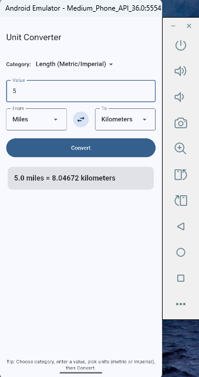
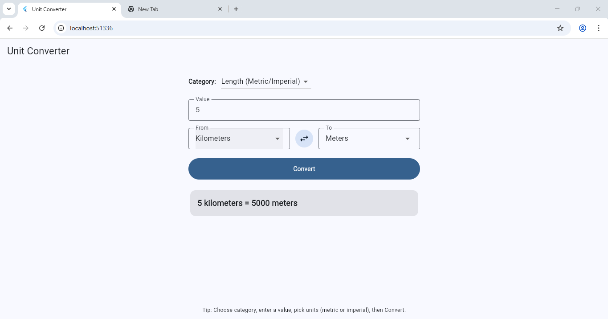
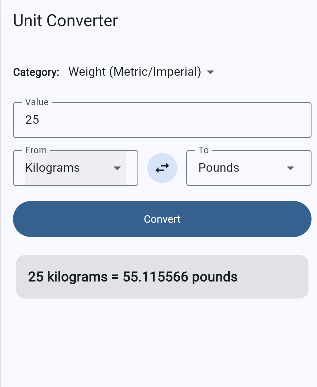

# Unit Converter (Flutter App)

A cross-platform Flutter application that converts between **metric** and **imperial** units of length, weight, and temperature.

## Features
- Length: meters, kilometers, feet, miles
- Weight: grams, kilograms, ounces, pounds
- Temperature: Celsius ↔ Fahrenheit
- Swap "From" and "To" units with one tap
- Runs on Windows, Android, iOS, and Web

## Running the App

### 1. List available devices
Check which devices are connected or available:
```bash
flutter devices
```

Typical output:
```
Windows (desktop) • windows
Chrome (web)      • chrome
emulator-5554     • Android Emulator
```

### 2. Run on Windows (desktop)
```bash
flutter run -d windows
```

### 3. Run on Android (emulator or real phone)
- Start an Android emulator from Android Studio **or** plug in a phone with USB debugging enabled.
- Then run:
```bash
flutter run -d emulator-5554
```
(Replace `emulator-5554` with the device ID shown in `flutter devices`.)

### 4. Run on iOS (requires macOS + Xcode)
On a Mac with Xcode installed:
```bash
flutter run -d ios
```

## Screenshots
### Android App

### Web App

### iOS App


