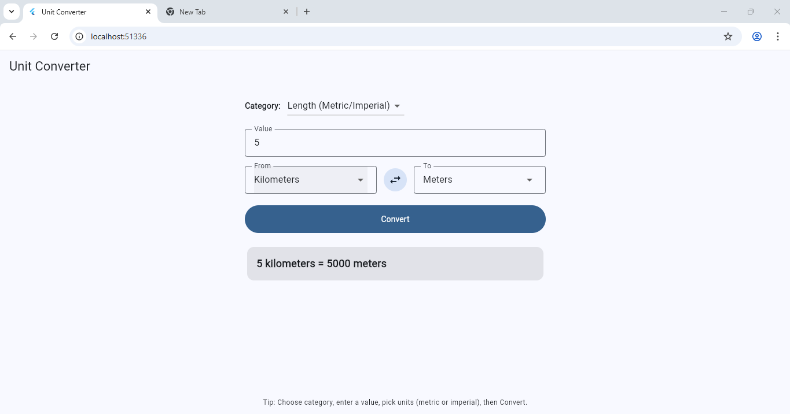
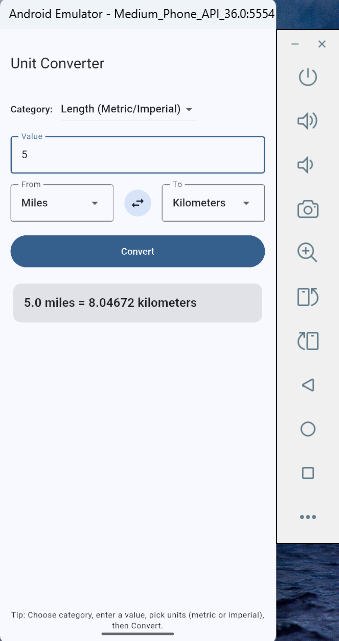
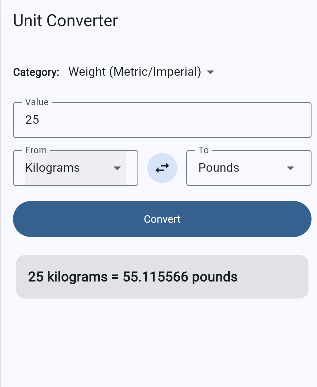

# Unit Converter (Flutter App)

A cross-platform Flutter application that converts between **metric** and **imperial** units of length, weight, and temperature.  
Built with [Flutter](https://flutter.dev) and Dart as part of the MSCS533 coursework.

---

## 📖 Overview
The Unit Converter app demonstrates cross-platform development using Flutter.  
It allows users to quickly convert values between metric and imperial units for **length, weight, and temperature**.  
The project showcases Flutter’s ability to run on **Windows, Android, iOS, and Web** from a single codebase.

---

## ✨ Features
- Convert between:
  - Length: meters, kilometers, feet, miles
  - Weight: grams, kilograms, ounces, pounds
  - Temperature: Celsius ↔ Fahrenheit
- Simple and responsive UI
- Swap "From" and "To" units with one tap
- Works across desktop, mobile, and web

---

## 📋 Prerequisites
Before running this project, ensure you have:
- Flutter SDK 3.35+ installed → [Flutter install guide](https://docs.flutter.dev/get-started/install)
- Dart (bundled with Flutter)
- Android Studio (for emulator & SDK tools)
- Xcode (for iOS development, macOS only)
- Git

Verify your setup with:
```bash
flutter doctor
```

---

## ⚙️ Setup Instructions

1. Clone the repository:
   ```bash
   https://github.com/nhemani33090/MSCS533-Assignment1-UnitConverter.git
   cd MSCS533-Assignment1-UnitConverter
   ```

2. Install dependencies:
   ```bash
   flutter pub get
   ```

3. List available devices:
   ```bash
   flutter devices
   ```

4. Run the app on your chosen platform:

- **Windows (desktop):**
  ```bash
  flutter run -d windows
  ```

- **Android (emulator or real device):**
  ```bash
  flutter run -d emulator-5554
  ```
  (Replace `emulator-5554` with the ID from `flutter devices`.)

- **iOS (requires macOS + Xcode):**
  ```bash
  flutter run -d ios
  ```

- **Web (Chrome):**
  ```bash
  flutter run -d chrome
  ```

---

## 📂 Project Structure
```
MSCS533-Assignment1-UnitConverter/
├── android/        # Android project files
├── ios/            # iOS project files
├── lib/
│   └── main.dart   # Main application entry point
├── screenshots/    # Screenshots for README
├── pubspec.yaml    # Project metadata & dependencies
└── README.md       # Project documentation
```

---

## 📷 Screenshots

### Web (Chrome)


### Android (Emulator)


### iOS (Simulator)


---

## 🚀 Future Improvements
- Add more unit categories (volume, area, speed)
- Add dark mode support
- Save conversion history

---
